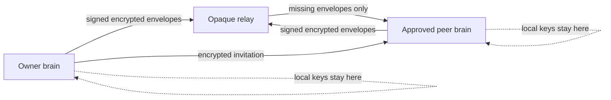

# Governed Federation

Governed Federation is the optional v1.1B collaboration layer. It synchronizes
selected, encrypted project-memory events between approved devices while every
participant keeps an independent local brain.

It is not required for ordinary single-user operation. Start with one local
project brain and the [10-minute Atlas path](ATLAS_10_MINUTE_PATH.md) before
enabling collaboration.

## Trust Model



- The relay stores content-addressed opaque envelopes and bounded inventory.
- Each event is signed by its author and encrypted to a scope epoch.
- Permissions are evaluated from the append-only capability ledger before
  ingestion, projection, retrieval, context, sync, export, and diagnostics.
- Concurrent evidence stays concurrent. Rta-Smriti does not silently choose a
  winner or use last-writer-wins for material decisions.
- Revocation atomically rotates every affected scope key to protect future
  data. It cannot erase plaintext that an authorized peer received before
  revocation.
- Public-key fingerprints identify devices, not verified people. Confirm a new
  peer's fingerprint through a separate trusted channel.

## Before You Begin

You need:

1. A healthy local project brain for each participant.
2. One private identity directory and a separate passphrase file per device.
3. A shared filesystem relay directory, or an explicitly operated HTTP relay.
4. A trusted way to compare public identity fingerprints.

Keep identity directories, passphrase files, invitations, local databases,
review bundles, and relay contents outside Git. Do not place them in a project
checkout or a synchronized public folder.

Run all examples with the installed `rta-brain` command and the correct
`--db` path for the local project brain. Add `--json` when scripting.

## 1. Create A Device Identity

```powershell
rta-brain federation identity create `
  --identity-dir C:\private\rta-identity `
  --passphrase-file C:\private\identity-passphrase.txt

rta-brain federation identity export-public `
  --identity-dir C:\private\rta-identity `
  --passphrase-file C:\private\identity-passphrase.txt `
  --output C:\exchange\device-public.json
```

On macOS or Linux, use equivalent private paths. Back up the encrypted identity
with `federation identity backup`; verify the backup before relying on it.

## 2. Create A Space And Scope

Federation mutations are always previewed against the current database state.
The apply step succeeds only with the exact current confirmation digest.

```powershell
rta-brain federation --db C:\private\atlas.sqlite --json plan `
  --project atlas `
  --action space-create `
  --actor-peer-id OWNER_PEER_ID `
  --parameters-json '{}'
```

Review the output, then apply it using the returned `confirmation_digest`:

```powershell
rta-brain federation --db C:\private\atlas.sqlite --json apply `
  --project atlas `
  --action space-create `
  --parameters-json '{}' `
  --identity-dir C:\private\rta-identity `
  --passphrase-file C:\private\identity-passphrase.txt `
  --confirmation-digest CONFIRMATION_DIGEST
```

Use the same `plan` then `apply` contract for:

| Action | Purpose |
| --- | --- |
| `scope-create` | Add a `team`, `review`, or `custom` protection scope |
| `peer-add` | Add a verified public device identity |
| `capability-grant` | Grant bounded `read`, `write`, `review`, or `admin` authority |
| `capability-revoke` | Remove authority and record the revocation event |
| `scope-rotate` | Generate a new epoch key for currently authorized peers |
| `capability-resolve` | Resolve a concurrent governance conflict explicitly |
| `quarantine-promote` | Accept a quarantined event after review |
| `quarantine-reject` | Reject a quarantined event with a durable reason |

Use `rta-brain federation inventory --project atlas` after each step. It
returns bounded identifiers, counts, state, and guidance without local paths or
event plaintext.

## 3. Invite A Peer Selectively

The owner first adds the peer and grants scope access, then issues an encrypted
invitation containing only the selected governance state and scope keys.

```powershell
rta-brain federation --db C:\private\atlas.sqlite invitation issue `
  --project atlas `
  --identity-dir C:\private\owner-identity `
  --passphrase-file C:\private\owner-passphrase.txt `
  --space-id SPACE_ID `
  --recipient-manifest C:\exchange\peer-public.json `
  --scope-id SCOPE_ID `
  --expires-at 2026-10-01T00:00:00Z `
  --output C:\exchange\atlas-invitation.json
```

The recipient runs `federation invitation preview` first, confirms the owner
fingerprint and selected scopes, then runs `federation invitation accept` with
the preview digest. Expired, rejected, and refreshed invitations retain local
immutable receipts.

## 4. Configure Managed Sync

Preview a filesystem relay configuration:

```powershell
rta-brain federation --db C:\private\atlas.sqlite --json sync daemon-preview `
  --project atlas `
  --space-id SPACE_ID `
  --scope-id SCOPE_ID `
  --identity-dir C:\private\rta-identity `
  --passphrase-file C:\private\identity-passphrase.txt `
  --relay-root C:\private\atlas-relay
```

Apply the exact preview with `daemon-configure --confirmation-digest ...`, then
use `daemon-start`, `daemon-status`, `daemon-stop`, and `daemon-remove`.

For HTTP transport, replace `--relay-root` with an `http://` or `https://`
`--relay-url` and provide a private relay capability file when required. Relay
URLs reject credentials, query strings, fragments, malformed ports, and
non-HTTP schemes, and redirects. Non-loopback relay binding requires explicit
operator opt-in. The relay capability is space-wide transport authorization;
rotate it separately when a revoked peer must immediately lose access to
opaque relay inventory and ciphertext.

The supervisor keeps one quiet managed worker. A live process is not enough for
health: relay availability, authorization, cursors, quarantine, projection,
and unresolved conflicts remain independent signals.

## 5. Search And Export Within Authority

```powershell
rta-brain federation --db C:\private\atlas.sqlite search `
  "accepted release evidence" `
  --project atlas `
  --space-id SPACE_ID `
  --actor-peer-id PEER_ID
```

Federated retrieval returns only authorized scopes and keeps source event IDs,
authors, epochs, temporal fields, and validation state.

Use `federation review-bundle preview` before `export`. The encrypted bundle
binds the recipient, selected scope, privacy ceiling, included evidence,
excluded items, and integrity digest. The recipient verifies before importing;
an editable summary never becomes authoritative evidence.

## Recovery And Incident Response

| State | Operator action |
| --- | --- |
| `relay_down` or `offline` | Keep working locally; retry after transport recovery |
| `partial` or `pending_parent` | Pull or repair missing envelopes; do not force projection |
| `conflict` | Inspect both histories and record an explicit decision |
| `revoked` | Confirm automatic scope rotation, rotate relay access when needed, then inspect prior-access exposure |
| `tampered` | Keep the envelope quarantined and compare author fingerprints |
| `key_missing` | Restore the verified identity backup or request a new invitation |
| `invalid_configuration` | Preview a corrected configuration; do not edit state files |

Run `federation status`, `federation inventory`, and `federation sync verify`
before and after recovery. Preserve receipts when reporting a defect, but remove
paths, peer identifiers, relay addresses, and private event content from public
reports.

## Security Boundary

Read the [v1.1B federation threat model](security/v1.1b-federation-threat-model.md).
The protocol protects selected project-memory exchange; it is not an identity
provider, managed key escrow, encrypted chat product, agent runtime, or public
collaboration cloud.
